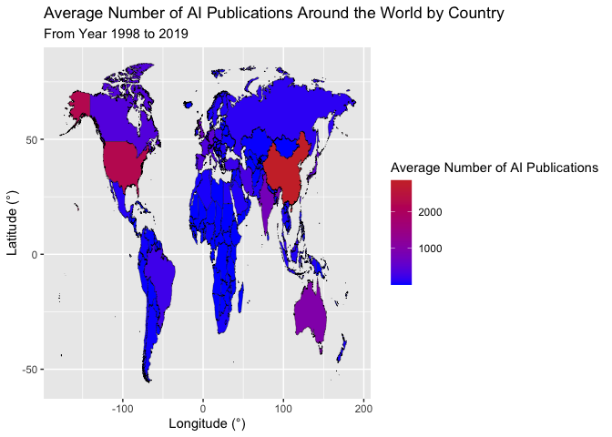
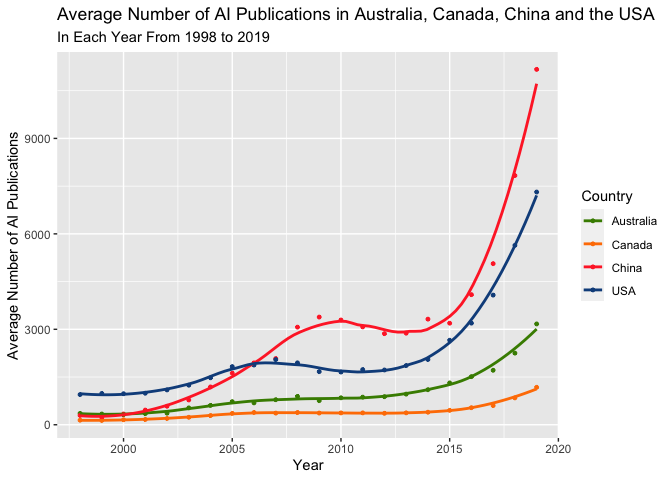
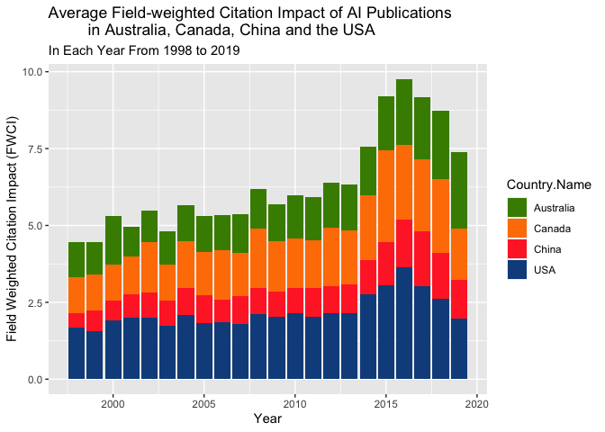

Worldwide AI Publications
================

## Code Chunks

``` r
library(tidyverse)
```

    ## ── Attaching packages ─────────────────────────────────────── tidyverse 1.3.1 ──

    ## ✓ ggplot2 3.3.5     ✓ purrr   0.3.4
    ## ✓ tibble  3.1.5     ✓ dplyr   1.0.7
    ## ✓ tidyr   1.1.4     ✓ stringr 1.4.0
    ## ✓ readr   2.0.2     ✓ forcats 0.5.1

    ## ── Conflicts ────────────────────────────────────────── tidyverse_conflicts() ──
    ## x dplyr::filter() masks stats::filter()
    ## x dplyr::lag()    masks stats::lag()

``` r
library(fivethirtyeight)
```

    ## Some larger datasets need to be installed separately, like senators and
    ## house_district_forecast. To install these, we recommend you install the
    ## fivethirtyeightdata package by running:
    ## install.packages('fivethirtyeightdata', repos =
    ## 'https://fivethirtyeightdata.github.io/drat/', type = 'source')

``` r
library(leaflet)
library(sf)
```

    ## Linking to GEOS 3.8.1, GDAL 3.2.1, PROJ 7.2.1

``` r
library(maps)
```

    ## 
    ## Attaching package: 'maps'

    ## The following object is masked from 'package:purrr':
    ## 
    ##     map

``` r
Global_AI_Index <- read.csv("https://docs.google.com/spreadsheets/d/e/2PACX-1vQJEgGNs1IzkJd1wL-pwmmcB2RK_EHw62BSmkM8SG_KVjJTZEgvu41DO7FsyCcdfEabZrpxbI053x_X/pub?output=csv")
Sectors <- read.csv("https://docs.google.com/spreadsheets/d/e/2PACX-1vQ2xK32BQqjKA7x8DdoQ3XS8lrQqd0y2a6D9rwJycBAAyzP5v-XEh15mO6tVoU-KlDRxeLfRN8JQL2I/pub?output=csv")
Academic_Corporate_Collaboration <- read.csv("https://docs.google.com/spreadsheets/d/e/2PACX-1vRQhONObYbYwE0jJJoJkmtY5UXxyVhBblUJTMeTVE2x4wyAgfLcFKk6rzOd_phJ2EDg4uAzE0jORnB_/pub?output=csv")
Gov_Readiness_Index <- read.csv("https://docs.google.com/spreadsheets/d/e/2PACX-1vRFDQqqUbDPRY-iiE8enf0xKubvi3TTaOdvvg-cO6Fr7n_eZlzmQ6aoY7JmF9-CLy67CxVlWqqgsKZT/pub?output=csv")

AI_Corp <- Global_AI_Index %>% 
  inner_join(Academic_Corporate_Collaboration, by = c("Country.Code", "Year"))

AI_Gov <- Global_AI_Index %>% 
 full_join(Gov_Readiness_Index, by = c("Country.Name", "Year"))

Global_AI <- Global_AI_Index %>% 
  rename(region = Country.Name) %>% 
  select(region, Number.of.AI.Publications, Year) %>% 
  group_by(region) %>% 
  summarise(Mean_Pub = mean(Number.of.AI.Publications))
world <- map_data("world")

AI_World <- Global_AI %>% 
  inner_join(world, by = "region") %>%
  filter(!is.na(region), !is.na(Mean_Pub))

AI_World_sf <- AI_World %>% 
  st_as_sf(coords = c("long", "lat"), crs = 4326)
```

``` r
China <- Global_AI_Index %>% 
  filter(Country.Code == "CHN")
USA <- Global_AI_Index %>% 
  filter(Country.Code == "USA")
Australia <- Global_AI_Index %>% 
  filter(Country.Code == "AUS")
Canada <- Global_AI_Index %>% 
  filter(Country.Code == "CAN")
AI_Index <- 
  China %>% 
  full_join(USA)
```

    ## Joining, by = c("Year", "Country.Code", "Country.Name", "Collaboration.Level", "Number.of.AI.Publications", "FWCI")

``` r
AI_Index <- 
  AI_Index %>% 
  full_join(Australia)
```

    ## Joining, by = c("Year", "Country.Code", "Country.Name", "Collaboration.Level", "Number.of.AI.Publications", "FWCI")

``` r
AI_Index <- 
  AI_Index %>% 
  full_join(Canada)
```

    ## Joining, by = c("Year", "Country.Code", "Country.Name", "Collaboration.Level", "Number.of.AI.Publications", "FWCI")

``` r
AI_Index <- AI_Index %>% 
  filter(!is.na(FWCI), !is.na(Number.of.AI.Publications)) %>% 
  group_by(Country.Name, Year) %>% 
  summarise(Mean_AI_Pub = mean(Number.of.AI.Publications),
            Mean_FWCI = mean(FWCI))
```

    ## `summarise()` has grouped output by 'Country.Name'. You can override using the `.groups` argument.

## Map

<!-- -->

## Plots

    ## `geom_smooth()` using method = 'loess' and formula 'y ~ x'

<!-- -->

    ## Warning: Ignoring unknown parameters: binwidth

<!-- -->
